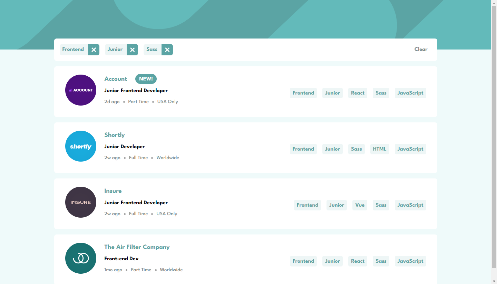

# Frontend Mentor - Job listings with filtering solution

This is a solution to the [Job listings with filtering challenge on Frontend Mentor](https://www.frontendmentor.io/challenges/job-listings-with-filtering-ivstIPCt). Frontend Mentor challenges help you improve your coding skills by building realistic projects. 

## Table of contents

- [Frontend Mentor - Job listings with filtering solution](#frontend-mentor---job-listings-with-filtering-solution)
  - [Table of contents](#table-of-contents)
  - [Overview](#overview)
    - [The challenge](#the-challenge)
    - [Screenshot](#screenshot)
    - [Links](#links)
  - [My process](#my-process)
    - [Built with](#built-with)
    - [What I learned](#what-i-learned)
    - [Useful resources](#useful-resources)
  - [Author](#author)


## Overview

### The challenge

Users should be able to:

- View the optimal layout for the site depending on their device's screen size
- See hover states for all interactive elements on the page
- Filter job listings based on the categories

### Screenshot




### Links

- Solution URL: [GitHub](https://github.com/nicknjagi/static-job-listings)
- Live Site URL: [live site ↗](https://dazzling-begonia-3e8d22.netlify.app/)

## My process

### Built with

- Semantic HTML5 markup
- Flexbox
- CSS Grid
- Mobile-first workflow
- [React](https://reactjs.org/) - JS library


### What I learned

I learned how to remove duplicates of arrays inside an array using this snippet 👇🏾

```js
Array.from(new Set(arrayName.map(JSON.stringify)), JSON.parse)
```


### Useful resources

- [Resource 1.](https://www.javascripttutorial.net/array/javascript-remove-duplicates-from-array/) - An article on how to remove duplicates in an array.
- [Resource 2.](https://www.internetingishard.com/html-and-css/flexbox/) - This Flexbox tutorial is a friendly tutorial for modern CSS layouts by [Interneting Is Hard](https://www.internetingishard.com/).

## Author

- Frontend Mentor - [@nicknjagi](https://www.frontendmentor.io/profile/nicknjagi)
- Twitter - [@nick_njagi](https://www.twitter.com/nick_njagi)
